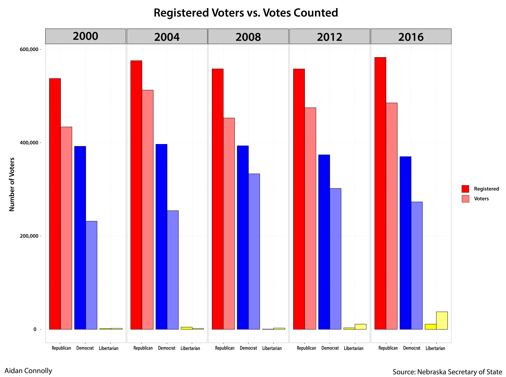
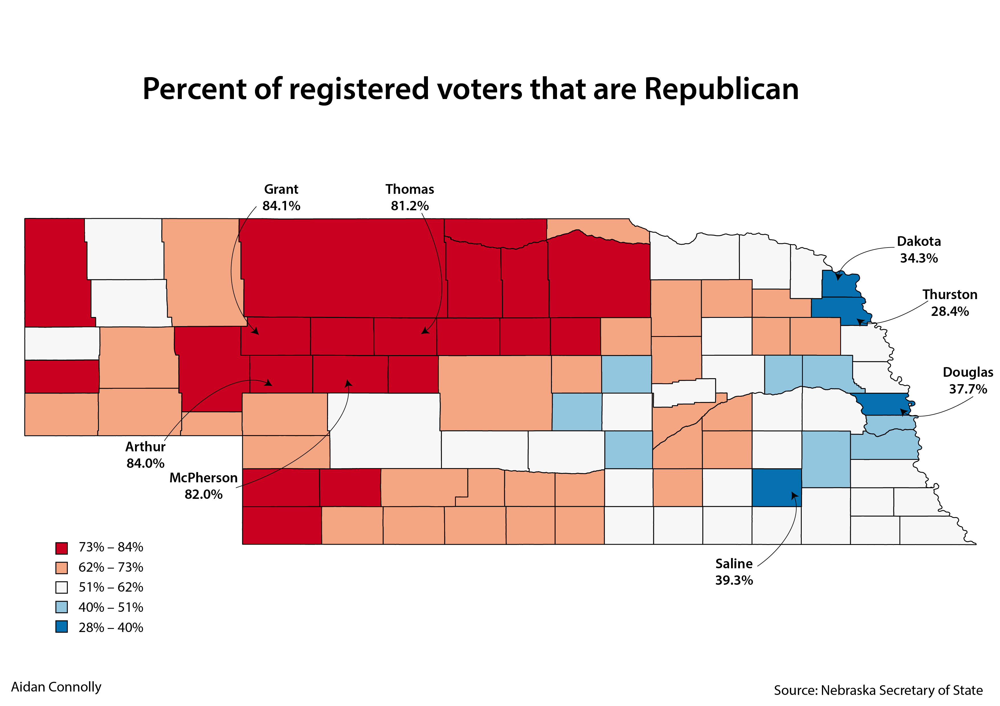
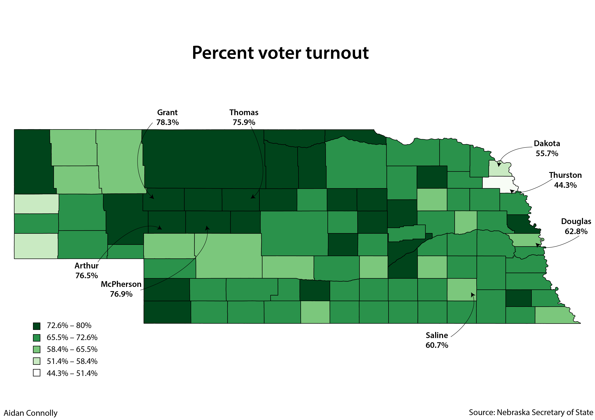
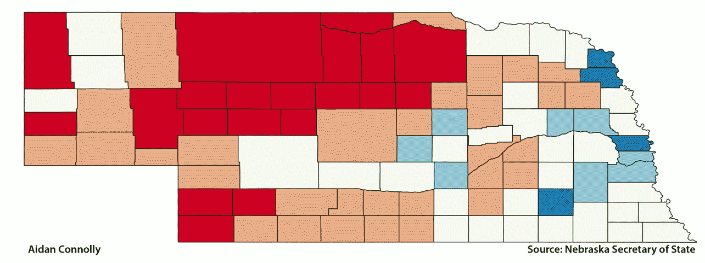
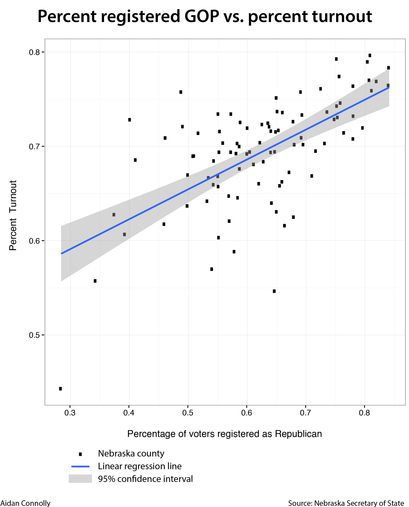

# A diminishing Democrat presence in Nebraska

Since 2000, the number of registered voters in Nebraska has increased by 11.6 percent. In that same time span and the number of registered Republicans in Nebraska has increased by 8.4 percent, the number of registered Libertarians has increased 523 percent. 

But the number of registered Democrats has decreased by 5.6 percent.

In some counties, that change was more extreme. In Butler County, the percentage of registered Republicans increased 41.7 percent. In Cedar County, the percentage increased 34 percent.

Republicans make up a smaller share of registered voters in only 13 of Nebraska's 93 counties.

As for the Democrats, every county saw a decrease in the percentage of registered Democrats. Four counties saw the percentage drop by more than 50 percent: McPherson, Thomas, Banner and Keya Paha.

This also has an impact on voter turnout.

### Counties with the lowest turnout percentage

County       | Percent turnout
------------ | ---------------
Thurston     | 44.3%
Kimball      | 54.6%
Dakota       | 55.7%
Scotts Bluff | 57.0%
Dawes        | 58.8%
Dawson       | 60.3%
Saline       | 60.7%
York         | 61.6%
Colfax       | 61.7%
Box Butte    | 62.1%

### Counties with the lowest Republican voter percentage

County    | Percent registered GOP
--------- | ----------------------
Thurston  | 28.4%
Dakota    | 34.3%
Douglas   | 37.5%
Saline    | 39.3%
Greeley   | 40.1%
Lancaster | 41.1%
Colfax    | 46.0%
Sarpy     | 46.2%
Sherman   | 48.8%
Cass      | 49.1%

The four counties with the lowest percentage of Republicans — Thurston, Dakota, Douglas and Saline — all had voter turnout percentages below the state average of 69.4 percent. Thurston County had the lowest turnout in the state at only 44 percent.

Meanwhile, the four counties with the highest percentages of Republicans — Grant, Arthur, McPherson and Thomas — all had voter turnout percentages above the state average. Grant County sat fourth with 78.3 percent turnout.

Map 1 | Map 2 
------------- | -------------
 | 

Below is a GIF to compare the two maps. 

 

If you plot each county in relation to its Republican voting percentage and voter turnout percentage, there is a positive correlation. 

The original data and reorganized data can be found in the [Data folder.](Data/)

The [Jupyter Notebook](VoterTurnout.ipynb) shows the process to create the ggplot graphs.

The [Mapping folder](Mapping/) holds the QGIS project files, Nebraska shapefile and data.

The [Images folder](Images/) holds the final pictures as well as the pictures used for the gif and the photoshop file used to create it.

